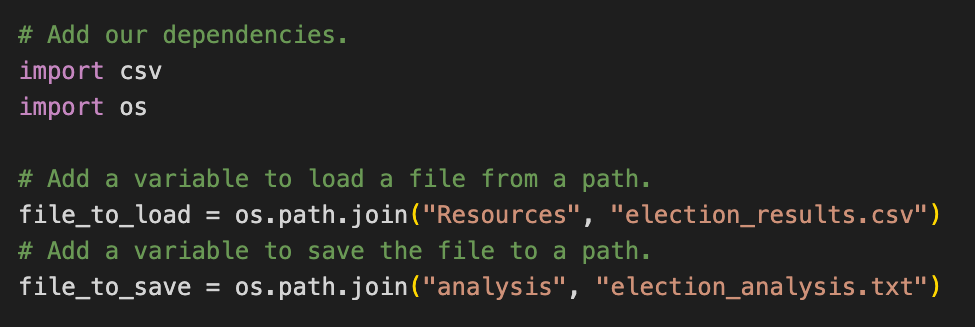

# Election_analysis

## Overview of Election Audit
A member of the Colorado Board of Elections gave me a series of tasks to complete an audit of the most recent congressional election. The tasks are as follows  
1. Total number of votes cast  
2. A complete list of candidates who received votes  
3. Total number of votes and percentage each candidate won  
4. Total number of votes and percentage each county won  
5. The winner of the election based on popular vote  
6. The county with the highest voter turnout  

## Election Audit Results: 
- There were 369, 711 total votes cast in the election.
- Jefferson County had 10.5% of the votes with 38,855 votes cast. Denver County had 82.8% of the votes with 306,055 votes cast. Arapahoe County had 6.7% of the votes with 24,801 votes cast. 
- Denver county had the largest number of votes.
- Stockham received 23% of the vote and 85,213 votes. Degette Received 73.8% of the vote and 272,892 votes. Doane received 3.1% of the vote and 11,606 votes
- The winner of the election was Diana DeGette who received 73.8% of the total vote and 272,892 votes out of 369, 711 total votes. 

## Resources Used
- Software: Python 3.9.0, Visual Studio Code 1.52.1
- Data Source: election_results.csv from supervisor.

## Audit Summary
The script I wrote for this election audit can be easily edited and used for any other election. I propose that you save and modify this script for future elections to avoid errors and increase audit efficiency.

  This script pulls data from the election_data.csv file that was provided to me to perform this analysis. The process I used to extract this data can be used for any other csv file. You can reuse and modify a lot of the beginning script pictured below. For example, you can view your csv file and adjust the row function to match your dataset. You can keep the same for-loop scripting for reading the data and modify the last two lines of code for more relevant parameters. See image of script below:
  

I use the file_to_load variable to locate the file on my drive by using the names of the folders the file is nested in and the name of the file in paraentheses separated by commas. I use the file_to_save variable to create a file for the results to be uploaded to for this particular election. By importing the os and csv modules, the script allows us to locate and update these files. The file_to_load and file_to_save_ variable can be easily modified to use towards the file for any election and to save the results under any file name by updating the values in the parentheses to be the relevent file names and folders the files are in.

